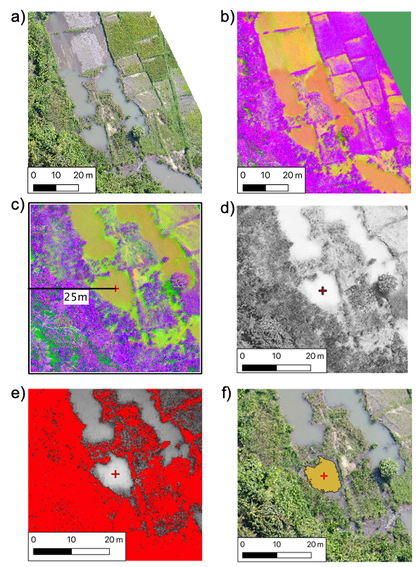
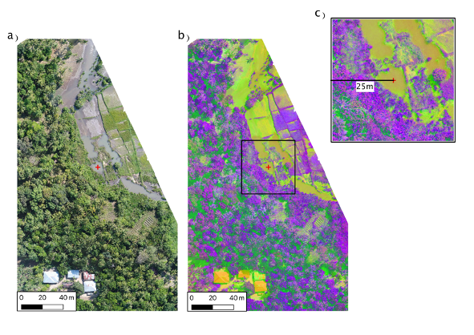

# Summary

In the fields of image analysis, computer vision and remote sensing
there are a number of instances where the digitisation of features by
the human operator is needed to develop mapped products or for
generating training data for classification routines. This process is
notoriously time consuming, labour intensive and error prone and, as
such, the manual digitisation of features in operational projects is
often unfeasible, particularly in time-sensitive applications like near
real-time monitoring applications, emergency response mapping or where
applications are made at a continental or global scaple. Consequently,
there is a need for a simple to use region growing tool that can be used
to speed up the digitisation process and minimise human error.

We present a new Region Growing plugin tool (RegionGrow) for the open
source Geographical Information System software QGIS. RegionGrow is
designed to be user-friendly, computationally efficient, freely
available, with functionality to accommodate a variety of sources of
multiband remotely sensed imagery to digitise discrete features and save these features into a vector dataset. By selecting a pixel in the centre of
an object of interest, e.g. a forest, water body etc, RegionGrow connects pixels with a similar colour based on its Euclidean
distance with a L\*A\*B transformed colour space. This rapidly speeds up
the manual digitising process and minimises error.

{width="3.937007874015748in"
height="5.369911417322835in"}

# Statement of Need

Within the open source software domain, there are very region growing tools available. Within the Semi-Automatic Classification (SAC) QGIS plugin [@Cogendo2021] is a region growing tool to select like pixels. However, this is intended to be used within the SAC classification workflow and cannot be used intuitively for other digitising needs. In addition there is the ‘Magic Wand’ [@Silvestri2017] plugin which are able to select regions within imagery of similar colour, within a set distance from the point of click and save those to a single vector dataset. However if desired features are outside of this set distance they will not be included in the vector dataset and a new vector layer will have to be produced to include these layers. 

An independent discrete feature region growing tool is needed for two primary reasons: 1) Where users wish to collect training data for conducting image classifications outside of the SAC plugin tool, for instance, taking advantage of the most current and robust machine learning solutions from within Python libraries like TPOT [@olson2016tpot] or Scikit-Learn [@pedregosa2011scikit]. 2) Where users wish to extract thematic information directly rather than following a classification routine. 

# Scope, Use Case and Limitations

The RegionGrow plugin was developed to allow non-experts to identify and digitise discrete targets of interest within UAV Imagery. This has been deployed operationally with the Spatial Intelligence System (SIS) for precision larviciding based in Zanzibar.

It was then developed to allow for the generation of training datasets which can be used in supervised image classification of a wide range of remotely sensed data, where a single vector dataset is produced. This dataset produces a series of features of differing attributes which relate to the target classes a user is trying to detect. 

The RegionGrow plugin, unlike MagicWand, is not deigned to select all features of similar colour across a whole image as this could introduce false positives where different tarrget features may exhibit different colours. Rather RegionGrow is designed to digitise discrete features identified by the user, where colour is only used to separate that feature from surrounding areas. 

# Ongoing Projects

The RegionGrow QGIS plugin tool was originally developed for use within
the project: Spatial Intelligence System (SIS) for precision larviciding
based in Zanzibar, United Republic of Tanzania. Here, UAV technology is
being used operationally to map pools of water where malarial mosquitoes breed. By
mapping these targets, they can be located by ground teams and treated
with low-toxicity larvicide in an effort to reduce the malarial mosquito population. 

Identifying and digitising water body features within UAV is a laborious and error-strewn process. Using RegionGrow operationally in this project, non-GIS specialists can now rapidly and accurately digitise these features, supplying vital information to ground-teams significantly quicker than following a conventional manual digitising approach (on average four times quicker).

# Using this Software

**Step 1.**

Remotely sensed imagery (e.g. UAV/satellite imagery) is loaded into
QGIS, ensuring that it is projected into a coordinate system (with map
units in metres), e.g. Universal Transverse Mercator (UTM).

Input RGB imagery (typically acquired using commercially available UAV
platforms) is converted into an *L\*A\*B* colour space, where colour is
represented by a luminosity channel (*l*), the colour on a red -- green
axis (*a*) and a blue-yellow axis (*b*) [@rathore2012colour; @baldevbhai2012color; @pandy2017rgblab]. A Comparission between the original RGB colour Image and the *L\*A\*B* transformed image can be seen in Figure 1.  The *L\*A\*B* colour space can help account for
the uneven distribution of RGB values within the colour image [@niu2014image]. Other imagery, i.e. multispectral optical imagery or radar
backscatter imagery, do not undergo colour transformation.

{width="3.937007874015748in"
height="5.369911417322835in"}

**Step 2.**

The user selects/clicks on a point of interest within the image. The
coordinates of the selected point is retrieved and a square
neighbourhood created (based on a user defined distance) as outlined in figure 3. A distance is supplied so the plugin only examines pixels which are nearby the user's point of click. As the plugin targets discrete features within the image, there is no requirement to examine pixels in the entire image.

{width="3.937007874015748in"
height="2.6625in"}

**Step 3.**

All pixels within the neighbourhood are plotted into a 3D feature space as shown in Figure 4.
The Euclidean colour distance between each pixel and the selected pixel
is determined. 
Pixels with a lower colour distance are considered to be
of a similar colour.

{width="3.937007874015748in"
height="3.284346019247594in"}

{width="3.937007874015748in"
height="4.587412510936135in"}

A linear spatial weighting is also applied where pixels geographically further
from the selected pixel have a lower weighting. This is done to ensure that pixels of similar colour but are far away from the users points of click are not considered to be part of the feature the user is trying to digitise.\

**Step 4.**

Pixels which can be considered to be of the same region can be defined where the colour distance, summed with the sptial distance have a value greater than the user defined threshold as described in equation 1. Where this condition is not met, pixels are set to set to 0  and considered to be no data values. 

{width="3.937007874015748in"
height="3.6587412510936135in"}

**Step 5.**

The output region (pixels of similar colour as defined by equation 1) are vectorised where they
intersect the originally selected pixel, i.e. they must be joined to the
selected pixel.

**Step 6.**

The geometry of this feature is then simplified, broken geometries fixed
and holes within the feature are filled, and a buffer applied if defined
by the user. The final region is committed to an output vector dataset
(e.g. ESRI Shapefile, GeoJSON) as the digitised feature an example can be seen in figure 7. 

{width="3.937007874015748in"
height="3.5722451881014874in"}

# Dependencies

There are no dependencies required for the RegionGrow QGIS plugin tool beyond the dependencies required and installed by QGIS.

# Funding

This Software Development was funded by the Bill and Melinda Gates Foundation Innovation Fund INV-010583 through a grant managed by the Innovative Vector Control Consortium (IVCC) and the Aberystwyth
University Doctoral training programme.

# References
